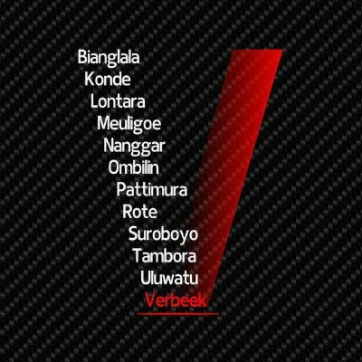

# Hello Markdown

Materi belajar markdown

## Header

# Ini header 1

Untuk membuat header, gunakan tanda pagar (#)

## List

Untuk membuat list, gunakan tanda bintang (*), atau angka 1

Tidak pake urutan
* list 1
* list 2

Menggunakan urutan
1. list dengan angka
1. list dengan angka

## Menyisipkan gambar

Contoh menggunakan gambar:




## Link

* [BlankOn](http://www.blankonlinux.or.id)

## Kode Program

`Ini kode inline`

```
Ini kode beberapa baris
Baris ke dua
```

## Tabel

Contoh tabel:

Tahun rilis | Nama Kode Rilis
----------- | ---------------
2005        | Biang Lala
2010        | BlankOn Konde
